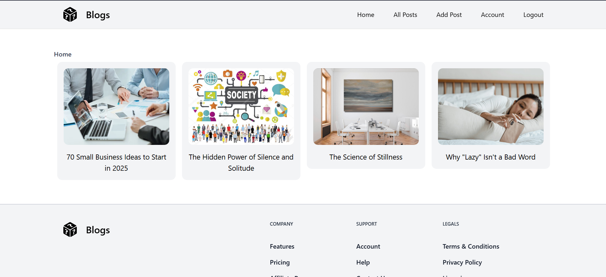
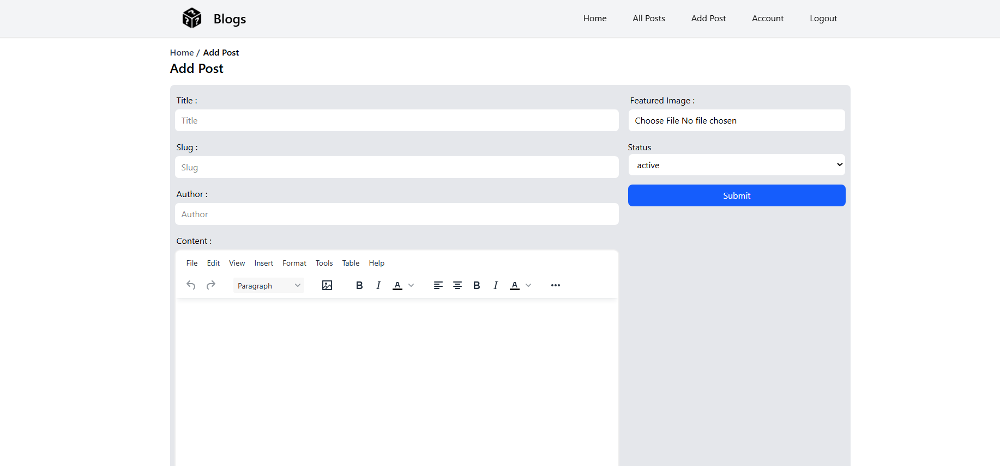

# React Blog App 🚀


I built this blog application as a learning project to understand industry-level programming concepts and practice React, Redux, and modern web development techniques. This project helped me gain hands-on experience with:

- Building complete React applications with Vite
- State management using Redux Toolkit
- Authentication flows and protected routes
- Form handling and validation
- Rich text editing capabilities
- API integration with Appwrite backend
- Project structure and organization
- Performance optimization techniques

The application demonstrates practical implementation of React hooks, component composition, and other modern React patterns.

## Live Demo
You can check out the live demo of the blog application at [https://react-blog-app-4vrc.onrender.com/]

## ✨ Features
- 🔐 User authentication (Login/Signup)
- ✍️ Rich text editor for post content
- 📝 Create, read, update, and delete posts
- 🏠 Home page with all posts
- 🖼️ Image support in posts
- 🚀 Fast performance with Vite
- 🔄 State management with Redux

## 🛠️ Tech Stack
### Frontend
- ⚛️ React 18
- ⚡ Vite (Build tool)
- 🎨 Tailwind CSS (Styling)
- 🔄 Redux Toolkit (State management)
- 📝 React RTE (Rich Text Editor)

### Backend
- 🔥 Appwrite (Backend service)
  - Database
  - Authentication
  - Storage

## 🚀 Installation
1. Clone the repository
```bash
git clone https://github.com/sahilsonvane/react-blog-app.git
cd react-blog-app
```

2. Install dependencies
```bash
npm install
```

3. Set up Appwrite
- Create a new Appwrite project
- Set up Database and Authentication
- Configure environment variables (create `.env` file):
```env
VITE_APPWRITE_URL=your_appwrite_url
VITE_APPWRITE_PROJECT_ID=your_project_id
VITE_APPWRITE_DATABASE_ID=your_database_id
VITE_APPWRITE_COLLECTION_ID=your_collection_id
VITE_APPWRITE_BUCKET_ID=your_bucket_id
```

4. Start development server
```bash
npm run dev
```

## 📸 Screenshots
### Home Page


### Add Post Page


## 🤝 Contributing
Contributions are welcome! Please open an issue or submit a pull request.

## 📄 License
MIT
